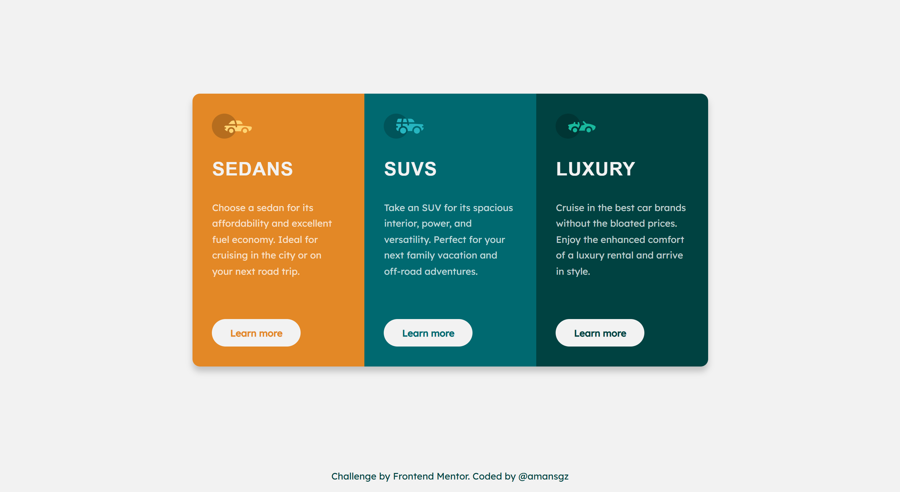

# Frontend Mentor - 3 column Preview Card Component

This is a solution to the [3-column preview card component challenge on Frontend Mentor](https://www.frontendmentor.io/challenges/3column-preview-card-component-pH92eAR2-).

## Table of contents

- [Overview](#overview)
  - [The challenge](#the-challenge)
  - [Screenshot](#screenshot)
  - [Links](#links)
- [My process](#my-process)
  - [Built with](#built-with)
  - [What I learned](#what-i-learned)
- [Author](#author)
- [Acknowledgments](#acknowledgments)

## Overview

### The challenge

Users should be able to:

- View the optimal layout depending on their device's screen size
- See hover states for interactive elements

### Screenshot



### Links

- Live Site URL: [https://fem-solutions.github.io/3-column-preview-card](https://fem-solutions.github.io/3-column-preview-card)
- Solution URL: [https://www.frontendmentor.io/solutions/3-column-preview-card-jQo4PrDm9x](https://www.frontendmentor.io/solutions/3-column-preview-card-jQo4PrDm9x)

## My process

### Built with

- Semantic HTML5 markup
- CSS custom properties
- Flexbox
- CSS Grid
- BEM Methodology
- Mobile-first workflow

### What I learned

While revisiting the challenge, I noticed something I had overlooked:

> _"The title says '3-column preview card **component** (singular). This implies **ONE** component with **THREE** columns, not three independants components"_

This insight shifted my perspective. It wasn't just about code that "worked" or "looked right". It was about HTML structure that faithfully communicates the design's meaning.

Applying this reflection, I restructured the architecture:

#### Semantic HTML Approach

This component follows a **single-component architecture**:

```html
<article class="card">
  <section class="card__column">Sedan</section>
  <section class="card__column">SUV</section>
  <section class="card__column">Luxury</section>
</article>
```

`article` represents a complete self-contained composition. In this challenge:

- The entire 3-column layout is the component
- A single column has no meaning without the others
- Therefore: one `<article>` wraps everything

`section` represent a thematic grouping of content. Here:

- Each column is a distinct theme (Sedan/SUV/Luxury)
- All themes together form the complete component
- Therefore: three `<section>` elements inside the `<article>`

#### Accessibility impact

- One clear landmark (the `<article>`)
- Proper heading hierarchy (h1 -> h2)
- Logical content flow for screen readers
- Semantic relationship between columns

#### BEM implementation

```css
.card {
} /* Block: entire component */
.card__column {
} /* Element: individual column */
.card__title {
} /* Element: column heading */
.card__text {
} /* Element: column description */
.card__button {
} /* Element: column button */

.card__column--sedans {
} /* Modifier: sedans */
.card__column--suvs {
} /* Modifier: suvs */
.card__column--luxury {
} /* Modifier: luxury */
```

That's the journey. Not perfect from the start - but curious enough to revisit, question and improve.

## Author

- Frontend Mentor - [@amansgz](https://www.frontendmentor.io/profile/amansgz)
- Github - [@amansgz](https://github.com/amansgz)

## Acknowledgments

- [Frontend Mentor](https://www.frontendmentor.io/) challenges help you improve your coding skills by building realistic projects.
